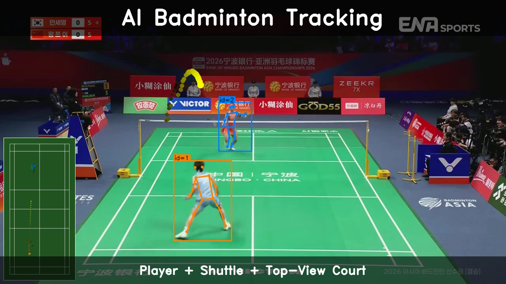
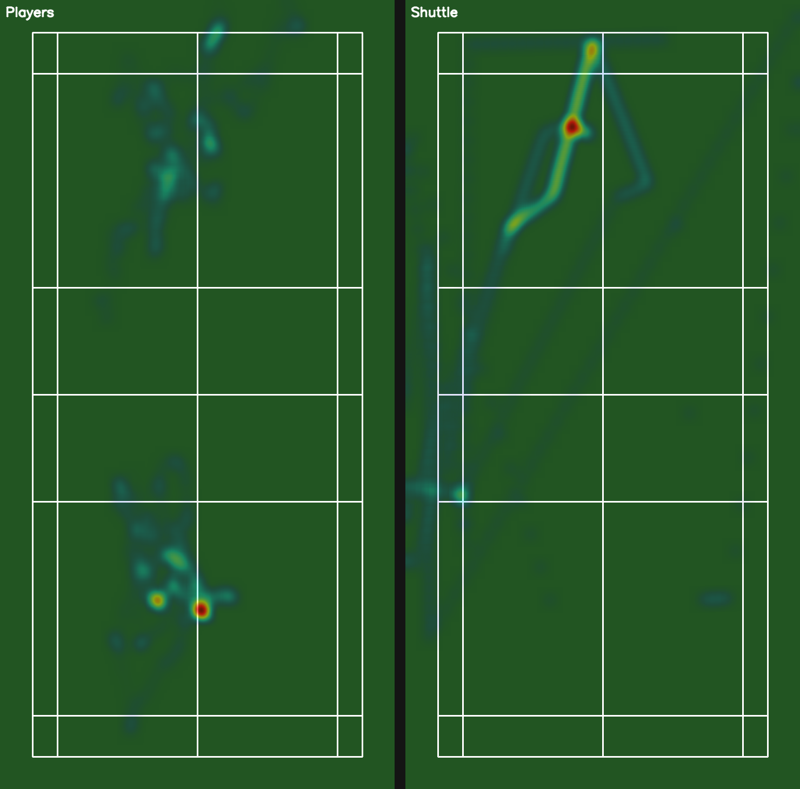
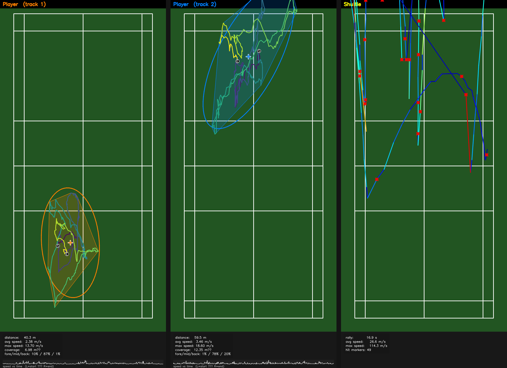

<div align="center">

# RallyLens

**배드민턴 경기 영상 → 선수·셔틀콕 추적 → 코트 시각화 → 한국어 LLM 랠리 분석 보고서**

*Automated badminton tracking, visualization, and LLM-authored match report pipeline.*

[](https://www.python.org/)
[](https://opensource.org/licenses/MIT)
[](https://docs.astral.sh/uv/)

YOLO11-pose · ByteTrack · TrackNetV3 · Vertex AI Gemini

</div>

---

## 데모 — Demo

[](https://youtu.be/fKwac0CsBLc)

> ▶ **[YouTube에서 보기](https://youtu.be/fKwac0CsBLc)** — 선수 바운딩 박스·스켈레톤·셔틀콕 잔상 + 좌측 하단 코트 탑뷰 PIP

### 코트 분석 시각화

<table>
  <tr>
    <td align="center"><strong>코트 궤적 애니메이션</strong><br><em>Court trajectory animation</em></td>
    <td align="center"><strong>히트맵 (선수 / 셔틀콕)</strong><br><em>Player & shuttle heatmaps</em></td>
  </tr>
  <tr>
    <td></td>
    <td></td>
  </tr>
</table>

<details>
<summary><strong>코트 다이어그램 상세 보기</strong> — 3-panel court diagram</summary>
<br>



*왼쪽: 1번 선수 궤적 / 가운데: 2번 선수 궤적 / 오른쪽: 셔틀콕 궤적*

</details>

### LLM 랠리 분석 보고서

[전체 보고서 보기 →](outputs/demo/report_demo.md)

<details>
<summary>보고서 미리보기 (접기/펼치기)</summary>

> **중앙 지배 전술 vs. 광범위 수비: 17초간의 격렬한 랠리 분석**
>
> 17초 동안 24번의 샷이 오간 매우 빠르고 긴 랠리입니다. 1번 선수는 코트 중앙(76.3%)과 중위(74.5%)를 중심으로 적은 움직임(40.3m)으로 경기를 효율적으로 운영했습니다. 반면, 2번 선수는 1번 선수보다 1.5배 가까운 59.5m를 이동하며 코트 후위(57.9%)로 밀려나 넓은 범위를 수비하는 데 체력을 소모했습니다.

</details>

---

## 주요 기능 — Features

- **선수 추적** — YOLO11-pose 골격 추정 + ByteTrack 멀티 트래커로 싱글스 선수 2명 자동 식별
- **셔틀콕 추적** — TrackNetV3 슬라이딩 윈도우 히트맵 추론으로 고속 셔틀콕 궤적 복원
- **코트 캘리브레이션** — Hough 기반 자동 코너 검출 (또는 인터랙티브 수동 선택)
- **시각화** — 오버레이 MP4 (탑뷰 PIP 포함) + 코트 궤적 GIF + 히트맵
- **LLM 분석 보고서** — Vertex AI Gemini 구조화 출력으로 한국어 랠리 분석 자동 생성
- **원커맨드 CLI** — `uv run rallylens run <url>` 하나로 다운로드부터 추적까지 일괄 실행

---

## 빠른 시작 — Quick Start

### 설치

```bash
git clone https://github.com/YeonSeong-Lee/rallylens
cd rallylens
brew install ffmpeg        # macOS; Linux: sudo apt install ffmpeg
uv sync
```

### 실행

```bash
# 1. YouTube 영상 다운로드 + 선수 추적 (one-command)
uv run rallylens run https://www.youtube.com/watch?v=<id>

# 2. 셔틀콕 추적 → 코트 캘리브레이션 → 시각화
uv run rallylens detect-shuttle data/raw/<video_id>.mp4
uv run rallylens calibrate data/raw/<video_id>.mp4
uv run rallylens viz data/raw/<video_id>.mp4

# 3. 한국어 LLM 분석 보고서 (Vertex AI 설정 필요 — 아래 참조)
uv run rallylens report data/raw/<video_id>.mp4
```

<details>
<summary><strong>선택: Vertex AI 보고서 설정</strong> — Gemini 기반 LLM 보고서 사용 시</summary>

`rallylens report` 는 Google Cloud Vertex AI Gemini 를 호출해 한국어 랠리 분석 보고서를 작성합니다. LLM 보고서 기능이 필요할 때만 아래 설정을 하면 됩니다.

#### 1. GCP 프로젝트 준비

- [Google Cloud Console](https://console.cloud.google.com/) 에서 프로젝트를 생성하거나 기존 프로젝트를 선택합니다.
- **Vertex AI API** 를 활성화합니다.

```bash
gcloud services enable aiplatform.googleapis.com --project=<your-project-id>
```

#### 2. 인증 (Application Default Credentials)

```bash
gcloud auth application-default login
```

브라우저가 열리면 Google 계정으로 로그인합니다. 로컬 머신에서 1회만 실행하면 됩니다.

#### 3. 의존성 설치 및 환경 변수 설정

```bash
uv sync --extra report          # google-genai optional 의존성 설치
cp .env.example .env            # 환경 변수 템플릿 복사
```

`.env` 파일을 열고 값을 채웁니다:

```dotenv
GOOGLE_CLOUD_PROJECT=your-gcp-project-id   # 필수
GOOGLE_CLOUD_LOCATION=us-central1          # 선택 (기본값: us-central1)
```

#### 4. 확인

```bash
uv run rallylens report data/raw/<video_id>.mp4
```

기본 모델은 `gemini-2.5-pro` 입니다. `--model` 옵션으로 변경할 수 있습니다.

> 인증 없이 결정론적 메트릭만 확인하고 싶다면 `rallylens report <video> --metrics-only` 로 실행합니다. `metrics.json` 만 생성하고 Gemini 호출은 건너뜁니다.

</details>

---

## 명령어 레퍼런스 — CLI Reference

아티팩트 경로는 `<video_id>` = 입력 파일명(stem) 기준으로 `data/` 하위에 저장됩니다.

### `run` — end-to-end 파이프라인

```bash
uv run rallylens run <url-or-path> [OPTIONS]
```

로컬 파일이면 바로 사용, YouTube URL이면 다운로드 후 선수 추적까지 일괄 실행.

<details>
<summary>옵션 상세</summary>

| 옵션 | 기본값 | 설명 |
|---|---|---|
| `--tracker [none\|bytetrack]` | `bytetrack` | 트래커 선택 |
| `--singles / --no-singles` | `singles` | 가장 안정적인 2개 트랙 ID만 유지 (싱글스) |
| `--imgsz` | `1280` | YOLO 추론 이미지 크기 |

</details>

### `ingest` — YouTube 다운로드

```bash
uv run rallylens ingest <youtube-url> [OPTIONS]
```

출력: `data/raw/<video_id>.mp4`. 클립 다운로드 시 파일명은 `<video_id>_<start>s_<end>s.mp4`.

<details>
<summary>옵션 상세</summary>

| 옵션 | 기본값 | 설명 |
|---|---|---|
| `--start` | 없음 | 시작 시간 (초 또는 `MM:SS` / `HH:MM:SS`) |
| `--end` | 없음 | 종료 시간 |
| `--force / --no-force` | `no-force` | 캐시 무시하고 재다운로드 |

</details>

### `detect` — 선수 추적

```bash
uv run rallylens detect <video_path> [OPTIONS]
```

출력: `data/detections/<video_id>/<video_id>_players.jsonl`

<details>
<summary>옵션 상세</summary>

| 옵션 | 기본값 | 설명 |
|---|---|---|
| `--tracker [none\|bytetrack]` | `bytetrack` | 트래커 선택 |
| `--singles / --no-singles` | `singles` | 가장 안정적인 2개 트랙 ID만 유지 (싱글스) |
| `--imgsz` | `1280` | YOLO 추론 이미지 크기 |

</details>

### `detect-shuttle` — 셔틀콕 추적

```bash
uv run rallylens detect-shuttle <video_path> [OPTIONS]
```

출력: `data/tracks/<video_id>/<video_id>_shuttle.jsonl`

<details>
<summary>옵션 상세</summary>

| 옵션 | 기본값 | 설명 |
|---|---|---|
| `--weights` | `models/shuttle_tracknet.pth` | TrackNetV3 가중치 경로 |

</details>

### `calibrate` — 코트 캘리브레이션

```bash
uv run rallylens calibrate <video_path> [OPTIONS]
```

출력: `data/calibration/<video_id>/corners.json`

<details>
<summary>옵션 상세</summary>

| 옵션 | 기본값 | 설명 |
|---|---|---|
| `--samples` | `20` | 코트 탐지에 사용할 샘플 프레임 수 |
| `--interactive` | off | OpenCV 창에서 코너를 직접 클릭/확정 |

</details>

### `viz` — 시각화

```bash
uv run rallylens viz <video_path> [OPTIONS]
```

사전에 `detect`, `detect-shuttle`, `calibrate` 아티팩트가 필요합니다.

출력: `data/viz/<video_id>/{<video_id>_overlay.mp4, viz_court.gif}`

<details>
<summary>옵션 상세</summary>

| 옵션 | 기본값 | 설명 |
|---|---|---|
| `--overlay / --no-overlay` | `on` | 선수·셔틀콕 오버레이 MP4 (코트 캘리브레이션 시 탑뷰 PIP 포함) |
| `--court / --no-court` | `on` | 코트 탑뷰 궤적 GIF (히트맵 배경 포함) |
| `--trail-len` | `30` | 셔틀콕 잔상 길이(프레임) |
| `--court-stride` | `5` | 코트 GIF에 포함할 프레임 간격 |
| `--court-scale` | `0.5` | 코트 GIF 다운스케일 비율 |

</details>

### `report` — Vertex AI 기반 랠리 분석 보고서

```bash
uv run rallylens report <video_path> [OPTIONS]
```

사전 조건: `detect` 와 `calibrate` 아티팩트 필요. `detect-shuttle` 은 권장 (없어도 동작하지만 샷·랠리 수치는 0).
Vertex AI 설정은 [빠른 시작](#빠른-시작--quick-start) 섹션의 접힘 블록 참조.

<details>
<summary>옵션 상세</summary>

| 옵션 | 기본값 | 설명 |
|---|---|---|
| `--model` | `gemini-2.5-pro` | Vertex AI Gemini 모델 ID |
| `--temperature` | `0.4` | 샘플링 온도 (0.0~1.0) |
| `--metrics-only` | off | LLM 호출 건너뛰고 `metrics.json` 만 생성 (인증 불필요) |
| `--skip-viz` | off | 코트 GIF·히트맵 자동 렌더 건너뛰기 |

출력:

```
data/reports/<video_id>/
├── metrics.json     # 결정론적 메트릭 (MatchMetrics schema v1)
├── report.json      # Gemini 구조화 응답 (ReportOutput schema v1)
└── report.md        # 렌더된 마크다운 보고서 — GitHub·VS Code·Obsidian에서 GIF 재생
```

</details>

---

## 출력 구조 — Output Layout

```
data/
├── raw/                 # 원본 영상
├── detections/          # 선수 추적 JSONL
├── tracks/              # 셔틀콕 추적 JSONL
├── calibration/         # 코트 코너 JSON
├── viz/                 # 오버레이 MP4 + 코트 GIF + 히트맵
└── reports/             # metrics.json + report.json + report.md
```

> `data/`는 `.gitignore`에 포함됩니다. 공개용 샘플은 `outputs/demo/`에 둡니다.

---

## 아키텍처 — Architecture

**"하나의 모듈 = 하나의 관심사, 의존 방향은 단방향"**

```
cli → pipeline → { vision, analysis, llm, viz, ingest }
                         ↓
                 { config, serialization, common, domain }
```

- `vision` 만 `ultralytics`/`cv2` 직접 import — 모델 코드가 이 레이어 밖으로 새지 않음
- `llm` 만 `google.genai` 직접 import — optional 의존성이므로 `report` 없이도 사용 가능
- `analysis` 는 결정론적 메트릭만 계산 — LLM 은 해석과 코칭 제안만 담당

<details>
<summary><strong>상세 아키텍처</strong> — 파일 트리 · 데이터 흐름 · 설계 결정</summary>

### 레이어 구조

```
src/rallylens/
├── cli.py              ← click 그룹. 서브커맨드는 pipeline 에 thin shim.
├── pipeline/           ← 오케스트레이션. vision/analysis/llm/viz 를 io 에 연결.
│   ├── io.py           ← video_id → 아티팩트 경로·save/load 단일 소스.
│   ├── orchestrator.py ← run_full_pipeline (ingest + detect)
│   ├── shuttle.py      ← run_shuttle_pipeline (TrackNetV3)
│   ├── court.py        ← run_court_detection
│   └── report.py       ← run_report_pipeline (metrics + viz + Gemini)
├── vision/             ← CV 추론 전용. 이 레이어만 ultralytics·cv2 직접 import.
│   ├── detect_track.py ← YOLO11-pose + ByteTrack → Detection
│   ├── tracknet.py        ← TrackNetV3 모델 정의
│   ├── shuttle_tracker.py ← TrackNetV3 추론 → ShuttlePoint, HitEvent
│   ├── court_detector.py  ← Hough → CourtCorners
│   └── court_picker.py   ← OpenCV 인터랙티브 코너 선택
├── analysis/           ← 결정론적 매치 메트릭 (LLM 없음).
│   └── metrics.py      ← compute_match_metrics → MatchMetrics
├── llm/                ← Vertex AI Gemini 래퍼. 이 레이어만 google.genai 직접 import.
│   ├── vertex_client.py ← ADC 기반 genai.Client 팩토리
│   ├── report_schema.py ← ReportOutput, PlayerInsight (구조화 응답)
│   ├── prompt.py       ← SYSTEM_PROMPT_KO
│   └── report.py       ← generate_report + render_report_markdown
├── viz/                ← 아티팩트 렌더링 전용. 모델 추론 없음.
│   ├── _utils.py       ← 코트 다이어그램, 호모그래피, 트레일 등 공용 헬퍼
│   ├── overlay.py      ← 비디오 오버레이 MP4 (탑뷰 PIP 합성 포함)
│   └── viz_court.py    ← 탑뷰 궤적 GIF (히트맵 배경 포함)
├── ingest/             ← yt-dlp 래퍼 (캐시 포함)
├── domain/             ← VideoProperties 등 도메인 모델
├── common.py           ← 로거, .env 로더, ffmpeg 체크, video I/O 컨텍스트 매니저
├── serialization.py    ← pydantic ↔ JSON/JSONL 헬퍼
└── config.py           ← 경로 상수만. rallylens 내부 import 전무.
```

### 의존 방향

```
cli → pipeline → { vision, analysis, llm, viz, ingest }
                         ↓
                 { config, serialization, common, domain }
```

- `config.py` 는 **rallylens 내부 어떤 것도 import 하지 않는 유일한 모듈**. 파일시스템 레이아웃이 바뀔 때 수정이 단 한 곳으로 수렴합니다.
- `pipeline.io` 는 `(video_id) → Path` 매핑과 `save_*` / `load_*` 헬퍼가 모여 있는 **단일 소스**. 새 아티팩트 종류를 추가할 때 경로·save·load 를 여기에만 추가하면 됩니다.
- `vision` 만 `ultralytics`/`cv2` 를 직접 import 합니다. 모델 텐들러 코드가 이 레이어 밖으로 새지 않아 `pyproject.toml` 의 mypy override 도 한 곳에만 필요합니다.
- `llm` 만 `google.genai` 를 직접 import 합니다. `google-genai` 는 optional 의존성이므로 `detect`·`viz` 만 쓰는 사용자는 설치 부담이 없습니다. `cli.py` 는 `from rallylens.pipeline import run_report_pipeline` 을 **lazy import** 로 처리해 `report` 명령을 실행할 때만 SDK 가 로드됩니다.
- `analysis` 는 `viz._utils` 의 court-geometry 유틸(`compute_homography`, `project_point`, `extract_hit_events`)을 import 합니다. 이는 peer-layer 직접 의존으로 엄밀히는 역전이며, `viz/_utils.py:8` TODO 에 court-geometry 를 `vision` 아래로 승격하는 계획이 명시돼 있습니다.

### `rallylens report` 데이터 흐름

```
detections.jsonl  ┐
shuttle.jsonl     ┼→ analysis.compute_match_metrics ─→ metrics.json
corners.json      ┘                  │
                                     ├──→ viz.render_viz_court ─→ viz_court.gif
                                     └──→ llm.generate_report ──→ ReportOutput ─→ report.json
                                                                         │
                                                                         ▼
                                                       llm.render_report_markdown
                                                                         │
                                                                         ▼
                                                             report.md (GIF·PNG 임베드)
```

### 핵심 설계 결정

1. **결정론 ↔ LLM 분리**: 수치는 파이썬이 계산, Gemini 는 해석과 코칭 제안만 작성합니다. 원본 detection 을 프롬프트에 담지 않기 때문에 토큰 비용은 입력 크기와 무관하게 상수이며, 숫자 환각 위험이 사라집니다.
2. **Pydantic 구조화 출력**: `response_schema=ReportOutput` 으로 Gemini 가 스키마를 강제 준수합니다.
3. **Markdown 은 결정론적 템플릿**: `render_report_markdown` 은 LLM 을 두 번 호출하지 않습니다. 수치는 `MatchMetrics` 에서 직접 인용하고, GIF·히트맵은 `os.path.relpath` 로 `report.md` 에 상대 경로로 임베드됩니다.
4. **Viz 자동 렌더**: `viz_court.gif` 가 없으면 `run_report_pipeline` 이 즉석에서 렌더합니다 (히트맵은 GIF 배경에 포함). 렌더 실패는 경고 로그만 남기고 보고서 작성은 계속됩니다.
5. **`--metrics-only` 이스케이프 해치**: Gemini 호출과 인증을 건너뛰고 `metrics.json` 만 생성. CI·로컬 튜닝에서 비용 없이 파이프라인을 돌릴 수 있습니다.

추가 규약(코딩 컨벤션, mypy 설정, 새 레이어 추가 시 주의점)은 [`CLAUDE.md`](CLAUDE.md) 를 참조하세요.

</details>

---

## 개발 — Development

```bash
uv run pytest             # 테스트
uv run ruff check src/    # 린트
uv run ruff format src/   # 포맷
uv run mypy               # 타입 체크
```

코딩 컨벤션·mypy override·새 레이어 추가 시 주의점은 [`CLAUDE.md`](CLAUDE.md) 에 정리돼 있습니다.

---

## 참고 자료 — References

### 알고리즘·모델

| 프로젝트 | 용도 | 링크 |
|---|---|---|
| TrackNetV3 | 셔틀콕 추적 (sliding-window heatmap inference) | [qaz812345/TrackNetV3](https://github.com/qaz812345/TrackNetV3) |
| TRACE | 코트 검출 · 히트 이벤트 감지 · 셔틀 탑뷰 투영 | [hgupt3/TRACE](https://github.com/hgupt3/TRACE) |
| Ultralytics YOLO11 | 선수 포즈 추정 + ByteTrack 통합 | [docs.ultralytics.com](https://docs.ultralytics.com/) |
| ByteTrack | 다중 객체 추적 (track ID 유지) | [ifzhang/ByteTrack](https://github.com/ifzhang/ByteTrack) |
| Vertex AI Gemini | 한국어 랠리 분석 보고서 생성 (구조화 출력) | [cloud.google.com/vertex-ai](https://cloud.google.com/vertex-ai) |

### 라이브러리

| 라이브러리 | 링크 |
|---|---|
| google-genai (Python SDK) | [googleapis/python-genai](https://github.com/googleapis/python-genai) |
| OpenCV | [opencv.org](https://opencv.org/) |
| PyTorch | [pytorch.org](https://pytorch.org/) |
| Pydantic | [docs.pydantic.dev](https://docs.pydantic.dev/) |
| yt-dlp | [yt-dlp/yt-dlp](https://github.com/yt-dlp/yt-dlp) |
| Click | [click.palletsprojects.com](https://click.palletsprojects.com/) |
| uv | [docs.astral.sh/uv](https://docs.astral.sh/uv/) |

---

## 라이선스 — License

MIT. YOLO11 weights are [AGPL-3.0](https://www.gnu.org/licenses/agpl-3.0.html); this project is for portfolio / educational use only.
