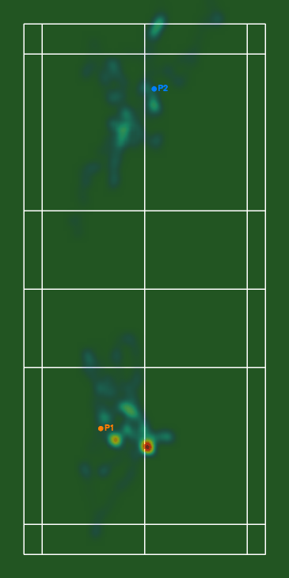

# RallyLens

> **배드민턴 경기 영상 → 선수/셔틀콕 추적 및 코트 시각화 자동화.**
> *Automated badminton player & shuttlecock tracking + court visualization pipeline.*

YOLO11-pose · ByteTrack · TrackNetV3 기반의 one-command CLI.

> **Status**: Active development. See [`TODO.md`](TODO.md) for the full roadmap.

---

## Demo

| Heatmap | Court trajectory |
|---|---|
|  |  |

선수 위치 히트맵(좌)과 코트 탑뷰 궤적 애니메이션(우). 17초 분량 싱글스 랠리 기준.

---

## 설치

```bash
git clone https://github.com/YeonSeong-Lee/rallylens
cd rallylens
brew install ffmpeg        # macOS; Linux: sudo apt install ffmpeg
uv sync
```

---

## 빠른 시작

```bash
# 1. YouTube 영상의 특정 구간 다운로드 → 선수 추적
uv run rallylens run https://www.youtube.com/watch?v=<id>

# 2. 셔틀콕 추적
uv run rallylens detect-shuttle data/raw/<video_id>.mp4

# 3. 코트 캘리브레이션
uv run rallylens calibrate data/raw/<video_id>.mp4

# 4. 시각화 (overlay MP4 + heatmap PNG + court GIF)
uv run rallylens viz data/raw/<video_id>.mp4
```

---

## 명령어 레퍼런스

아티팩트 경로는 `<video_id>` = 입력 파일명(stem) 기준으로 `data/` 하위에 저장됩니다.

### `ingest` — YouTube 다운로드

```bash
uv run rallylens ingest <youtube-url> [--start 1:30] [--end 2:00] [--force]
```

| 옵션 | 기본값 | 설명 |
|---|---|---|
| `--start` | 없음 | 시작 시간 (초 또는 `MM:SS` / `HH:MM:SS`) |
| `--end` | 없음 | 종료 시간 |
| `--force / --no-force` | `no-force` | 캐시 무시하고 재다운로드 |

출력: `data/raw/<video_id>.mp4`. 클립 다운로드 시 파일명은 `<video_id>_<start>s_<end>s.mp4`.

### `detect` — 선수 추적

```bash
uv run rallylens detect <video_path> [--tracker bytetrack] [--singles] [--imgsz 1280]
```

| 옵션 | 기본값 | 설명 |
|---|---|---|
| `--tracker [none\|bytetrack]` | `bytetrack` | 트래커 선택 |
| `--singles / --no-singles` | `singles` | 가장 안정적인 2개 트랙 ID만 유지 (싱글스) |
| `--imgsz` | `1280` | YOLO 추론 이미지 크기 |

출력: `data/detections/<video_id>/<video_id>_players.jsonl`

### `detect-shuttle` — 셔틀콕 추적

```bash
uv run rallylens detect-shuttle <video_path> [--weights models/shuttle_tracknet.pth]
```

출력: `data/tracks/<video_id>/<video_id>_shuttle.jsonl`

### `calibrate` — 코트 캘리브레이션

```bash
uv run rallylens calibrate <video_path> [--samples 20] [--interactive]
```

| 옵션 | 기본값 | 설명 |
|---|---|---|
| `--samples` | `20` | 코트 탐지에 사용할 샘플 프레임 수 |
| `--interactive` | off | OpenCV 창에서 코너를 직접 클릭/확정 |

출력: `data/calibration/<video_id>/corners.json`

### `viz` — 시각화

```bash
uv run rallylens viz <video_path> [--overlay] [--heatmap] [--court] \
    [--trail-len 30] [--court-stride 5] [--court-scale 0.5]
```

사전에 `detect`, `detect-shuttle`, `calibrate` 아티팩트가 필요합니다.

| 옵션 | 기본값 | 설명 |
|---|---|---|
| `--overlay / --no-overlay` | `on` | 선수·셔틀콕 오버레이 MP4 |
| `--heatmap / --no-heatmap` | `on` | 위치 히트맵 PNG |
| `--court / --no-court` | `on` | 코트 탑뷰 궤적 GIF |
| `--trail-len` | `30` | 셔틀콕 잔상 길이(프레임) |
| `--court-stride` | `5` | 코트 GIF에 포함할 프레임 간격 |
| `--court-scale` | `0.5` | 코트 GIF 다운스케일 비율 |

출력: `data/viz/<video_id>/{<video_id>_overlay.mp4, heatmap.png, court_diagram.gif}`

### `run` — end-to-end 파이프라인

```bash
uv run rallylens run <url-or-path> [--tracker bytetrack] [--singles] [--imgsz 1280]
```

로컬 파일이면 바로 사용, YouTube URL이면 다운로드 후 선수 추적까지 일괄 실행.

---

## 출력 디렉토리 구조

```
data/
├── raw/                          # 다운로드 원본 영상
│   └── <video_id>.mp4
├── detections/
│   └── <video_id>/<video_id>_players.jsonl
├── tracks/
│   └── <video_id>/<video_id>_shuttle.jsonl
├── calibration/
│   └── <video_id>/corners.json
└── viz/
    └── <video_id>/
        ├── <video_id>_overlay.mp4
        ├── heatmap.png
        └── court_diagram.gif
```

`data/`는 `.gitignore`에 포함됩니다. 공개용 샘플은 `outputs/demo/`에 둡니다.

---

## 개발

```bash
uv run pytest             # 테스트
uv run ruff check src/    # 린트
uv run ruff format src/   # 포맷
uv run mypy               # 타입 체크
```

아키텍처 개요는 [`CLAUDE.md`](CLAUDE.md) 참조.

---

## License

MIT. YOLO11 weights are AGPL-3.0; this project is for portfolio / educational use only.
